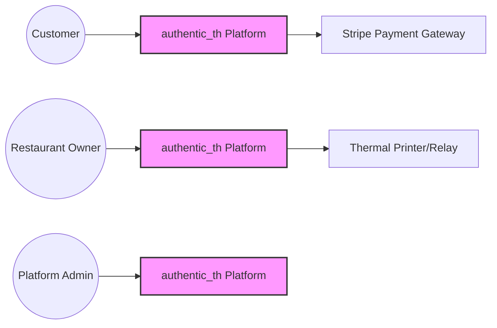
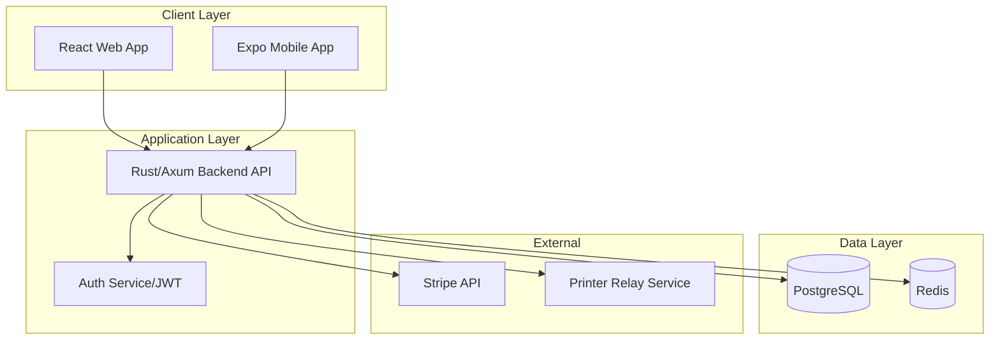

# Software Architecture Document (SAD): authentic_th

**Version**: 1.1  
**Standard**: ISO/IEC/IEEE 42010:2022  
**Framework**: arc42  
**Project**: authentic_th - Multi-tenant Food Ordering System  

---

## 1. Introduction and Goals

### 1.1 Purpose
This document defines the software architecture for the `authentic_th` platform, a multi-tenant food ordering system enabling restaurants to manage digital storefronts, orders, and loyalty programs while providing platform administrators with a centralized governance portal.

### 1.2 Goals and Constraints
| Goal | Priority | Description |
| :--- | :--- | :--- |
| **Multi-tenancy** | High | Strict data isolation between different restaurant owners. |
| **Regulatory Compliance** | High | Adherence to Australian PDPA (Privacy Act 1988) for data handling. |
| **Hardware Integration** | High | Reliable delivery of orders to physical thermal printers in kitchens. |
| **Scalability** | Medium | Support for a growing number of tenants without linear infrastructure cost increase. |
| **Omni-channel** | Medium | Consistent experience across Web (React) and Mobile (Expo). |

---

## 2. Architecture Constraints

### 2.1 Technical Constraints
- **Stack**: Must utilize Rust (Backend) and TypeScript (Frontend/Mobile) for a balance of high performance, memory safety, and developer velocity.
- **Database**: Relational storage (PostgreSQL) required for complex order/tenant relationships.
- **Payments**: Integration limited to Stripe for PCI-DSS compliance.

### 2.2 Business Constraints
- **Compliance**: Must implement data residency/handling per Australian law.
- **Deployment**: Cloud-native approach to minimize local server maintenance for restaurant owners.

---

## 3. System Scope

### 3.1 Business Context (C4 Level 1)
The system interacts with three primary personas and two external systems.

### 3.2 Functional Scope
- **Storefront**: Menu browsing, Cart management, Order placement (UR-C01), Loyalty point redemption.
- **Backend (Restaurant)**: Order management, Menu editing, Printer configuration, Sales reporting.
- **Governance Portal**: Tenant onboarding, Subscription management, Platform-wide analytics.

---

## 4. Solution Strategy

### 4.1 Overall Approach
The system adopts a **Modular Monolith** architecture transitioning toward microservices if scale demands. It uses a **Shared Database with Discriminator Column** strategy for multi-tenancy to balance operational simplicity with scalability.

### 4.2 Key Technical Choices
- **Frontend Web**: React + TypeScript. Provides a flexible and highly reactive user interface for both the Storefront and the Governance Portal.
- **Mobile**: React Native via Expo. Chosen for rapid development cycles, ease of updates (OTA), and consistent performance across iOS and Android.
- **Backend**: Rust + Axum. Chosen for memory safety (eliminating common runtime crashes), high concurrency performance, and a strong type system that reduces production bugs. Axum provides a modular, ergonomic web framework that leverages the `tokio` ecosystem for asynchronous I/O.
- **Auth**: Centralized JWT-based authentication with Role-Based Access Control (RBAC).

---

## 5. Building Block View (C4 Level 2)

### 5.1 Container Diagram
The system is divided into logical containers to separate concerns and scaling needs.

### 5.2 Building Block Descriptions
- **Web App**: Handles Storefront and Admin panels. Built with React and TypeScript.
- **Mobile App**: Customer app for ordering and Owner app for order notifications, developed using Expo for cross-platform efficiency.
- **Backend API**: The core business logic written in Rust/Axum. Handles tenant validation, order processing, and loyalty logic with high efficiency.
- **Database**: Stores all tenant data. Every table (Orders, Menu, Users) contains a `tenant_id`.

---

## 6. Runtime View

### 6.1 Order Placement Flow
1. **Customer** selects items $\rightarrow$ API validates `tenant_id` for the specific store.
2. **API** calculates total $\rightarrow$ Requests payment intent from **Stripe**.
3. **Stripe** confirms payment $\rightarrow$ API marks order as `Paid`.
4. **API** triggers **Printer Relay Service** $\rightarrow$ Physical thermal printer prints ticket in kitchen.
5. **Notification** sent to **Restaurant Owner** via Mobile App (WebSocket/Push).

---

## 7. Deployment View

- **Cloud Provider**: AWS or GCP.
- **Containerization**: Docker images using multi-stage builds. Rust binaries are compiled for the target architecture and deployed in slim, distroless images to minimize the attack surface and image size.
- **Database**: Managed PostgreSQL (RDS/Cloud SQL) with automated backups for PDPA compliance.
- **CDN**: Cloudfront/Vercel/Netlify for global storefront delivery.

---

## 8. Cross-Cutting Concepts

### 8.1 Multi-tenancy Isolation
Data isolation is enforced at the **Repository Layer**. Every query MUST include a `WHERE tenant_id = :current_tenant` clause. A middleware extracts the `tenant_id` from the request header or JWT token.

### 8.2 Security & Compliance
- **Auth**: RBAC ensures a Restaurant Owner cannot access another owner's data or the Governance Portal.
- **PDPA**: Implementation of "Right to be Forgotten" (soft deletes $\rightarrow$ hard purge) and data encryption at rest.
- **Payments**: No credit card data touches the local server (Stripe Elements/Checkout).

---

## 9. Architecture Decisions (ADRs)

### ADR 01: Multi-tenancy Strategy
- **Decision**: Use a shared database with a `tenant_id` discriminator column.
- **Context**: We need to support hundreds of small restaurants without the overhead of managing hundreds of database schemas.
- **Consequence**: Simpler migrations and lower cost. Requires rigorous developer discipline to prevent "data leaks" between tenants.

### ADR 02: Printer Integration
- **Decision**: Implement a lightweight Cloud-to-Local Relay Service.
- **Context**: Web browsers cannot directly communicate with local USB/Network thermal printers due to security sandboxing.
- **Consequence**: Requires a small agent installed on the restaurant's local PC or a compatible cloud-print API.

### ADR 03: Tech Stack Selection
- **Decision**: Rust (Axum), React (TypeScript), and Expo (React Native).
- **Context**: 
    - The backend requires high reliability and performance for concurrent order processing and strict safety to avoid runtime crashes (Rust).
    - the web frontend requires a modern, component-based architecture for scalability and maintainability (React/TS).
    - The mobile requirement demands a single codebase for iOS and Android with a fast iteration cycle and simplified deployment/updates (Expo).
- **Consequence**: Increased backend complexity compared to Node.js, but significantly higher performance and safety. High developer velocity on the frontend and mobile ends.

---

## 10. Quality Requirements

| Req ID | Quality Attribute | Requirement | Metric |
| :--- | :--- | :--- | :--- |
| **QR-01** | Availability | Storefronts must be available 24/7. | 99.9% Uptime |
| **QR-02** | Performance | Order submission to printer trigger. | < 3 seconds |
| **QR-03** | Security | Data isolation between tenants. | 0 cross-tenant leak incidents |
| **QR-04** | Legal | Australian PDPA compliance. | Annual audit pass |

---

## 11. Risks and Technical Debt

- **Risk**: The "Shared Database" approach may become a bottleneck if a single tenant grows exponentially.
- **Mitigation**: Architect the repository layer to allow migrating a specific `tenant_id` to a dedicated database (sharding) in the future.
- **Debt**: Initial printer integration may rely on third-party relays which could introduce a single point of failure.

---

## 12. Glossary

| Term | Definition |
| :--- | :--- |
| **Tenant** | A specific restaurant entity using the platform. |
| **Governance Portal** | The administrative interface for the platform owners. |
| **PDPA** | Personal Data Protection Act (Australia). |
| **RBAC** | Role-Based Access Control. |
| **Discriminator** | A column used to distinguish between different tenants in a shared table. |
