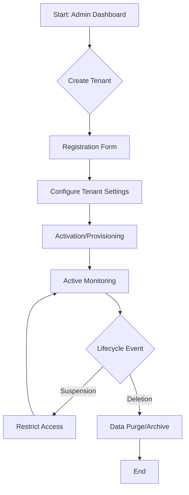
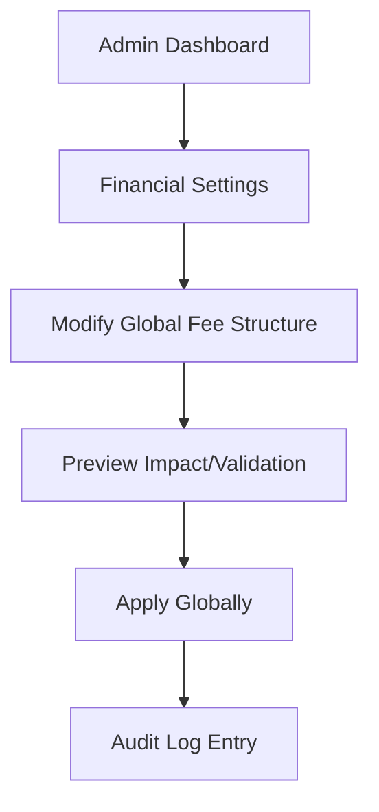
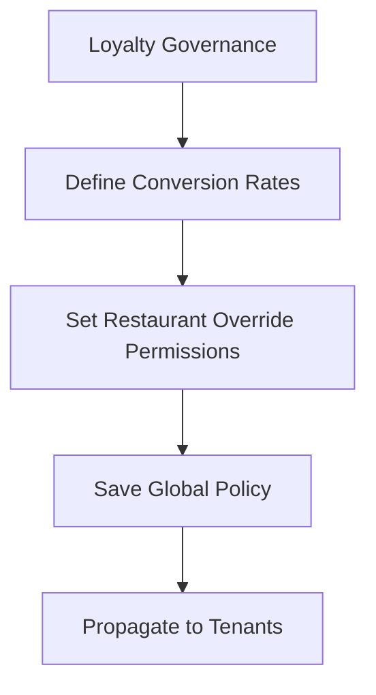
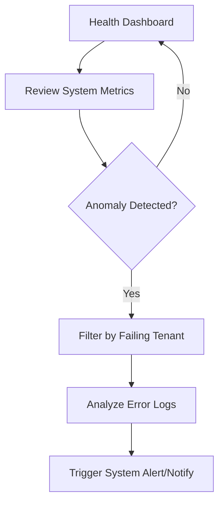
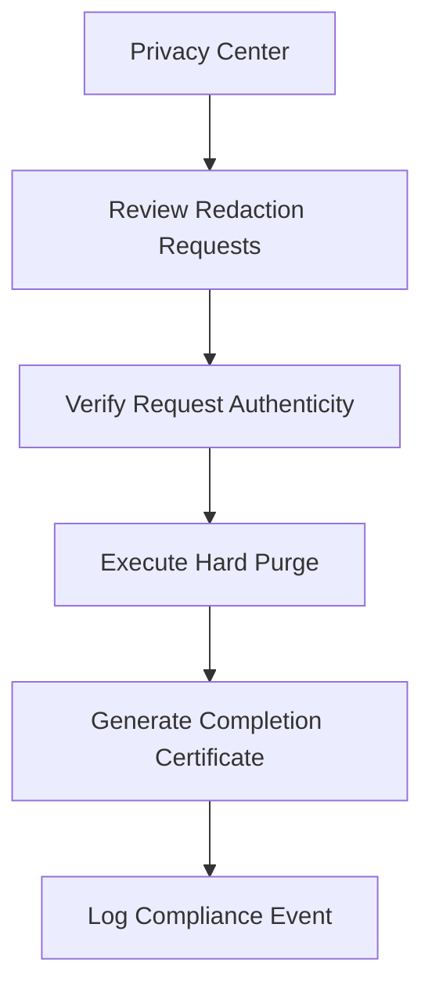

# User Flow Maps: System Admin Web App (Governance Portal)

This document defines the detailed user journeys for the **Governance Portal**, the high-level administrative interface used by Platform Administrators (Founders/Co-founders). 

## Design Framework
Following the **Trigger $\rightarrow$ Action $\rightarrow$ System Response** methodology, these flows map the intersection of user intent, UI state transitions, and backend API interactions.

**Tech Stack Architecture:**
- **Frontend**: React + TypeScript $\rightarrow$ TanStack Query (State/Caching) $\rightarrow$ Tailwind CSS (Styling).
- **Backend**: Rust (Axum) $\rightarrow$ PostgreSQL (via SQLx) $\rightarrow$ Redis (Caching/Queues).

---

## 1. Tenant Lifecycle Management Flow
**Journey Name**: End-to-End Tenant Provisioning & Governance.
**Requirement**: `UR-A01` (Tenant Mgmt).

### Flow Diagram

### Step-by-Step Breakdown
| Step | User Action | UI State Transition | System/API Interaction | Outcome |
|:---|:---|:---|:---|:---|
| 1 | Click "Add New Tenant" | $\rightarrow$ Tenant Registration Modal | `GET /api/v1/tenants/plans` | Valid plans loaded into dropdown. |
| 2 | Submit Registration (Name, Domain, Plan) | $\rightarrow$ Pending Configuration Screen | `POST /api/v1/tenants` | Tenant record created with `status: PENDING`. |
| 3 | Set Domain & Auth Config | $\rightarrow$ Config Form $\rightarrow$ Success Toast | `PATCH /api/v1/tenants/{id}/config` | Tenant configuration saved to DB. |
| 4 | Click "Activate Tenant" | $\rightarrow$ Loading State $\rightarrow$ Active Badge | `POST /api/v1/tenants/{id}/activate` | Tenant status updated to `ACTIVE`; domain routed. |
| 5 | Monitor Tenant Health | $\rightarrow$ Tenant Detail View (Metrics) | `GET /api/v1/tenants/{id}/metrics` | Real-time API latency/order volume displayed. |
| 6 | Trigger "Suspend Tenant" | $\rightarrow$ Confirmation Dialog $\rightarrow$ Suspended Badge | `POST /api/v1/tenants/{id}/suspend` | All requests for `tenant_id` return 403 Forbidden. |
| 7 | Trigger "Delete Tenant" | $\rightarrow$ Danger Warning $\rightarrow$ Removal from List | `DELETE /api/v1/tenants/{id}` | Hard purge of tenant data (PDPA compliant). |

---

## 2. Global Financial Configuration Flow
**Journey Name**: Platform-wide Revenue & Fee Management.
**Requirement**: `BMR-003` (Financial Collection) / `UR-A01`.

### Flow Diagram

### Step-by-Step Breakdown
| Step | User Action | UI State Transition | System/API Interaction | Outcome |
|:---|:---|:---|:---|:---|
| 1 | Navigate to "Financial Settings" | $\rightarrow$ Billing Config Page | `GET /api/v1/governance/billing` | Current global fees loaded. |
| 2 | Update Fee (e.g., 2.5% $\rightarrow$ 3.0%) | $\rightarrow$ Input Field Change | N/A (Local State) | New value staged in React state. |
| 3 | Click "Validate Changes" | $\rightarrow$ Validation Spinner $\rightarrow$ Impact Preview | `POST /api/v1/governance/billing/validate` | System calculates projected revenue shift. |
| 4 | Confirm "Apply to All" | $\rightarrow$ Loading $\rightarrow$ Success Alert | `PUT /api/v1/governance/billing/global` | Global config updated; cache invalidated in Redis. |
| 5 | Review Change Log | $\rightarrow$ Audit Table Update | `GET /api/v1/governance/audit-logs` | Entry created: "Admin X changed fee to 3.0%". |

---

## 3. Global Loyalty Governance Flow
**Journey Name**: Loyalty Program Rule Definition.
**Requirement**: `UR-A02` (Loyalty Rules).

### Flow Diagram

### Step-by-Step Breakdown
| Step | User Action | UI State Transition | System/API Interaction | Outcome |
|:---|:---|:---|:---|:---|
| 1 | Open "Loyalty Settings" | $\rightarrow$ Loyalty Governance Panel | `GET /api/v1/governance/loyalty` | Current point rates loaded. |
| 2 | Set Default Rate (e.g., $1 = 1pt) | $\rightarrow$ Input Field Change | N/A (Local State) | Rate updated in UI. |
| 3 | Toggle "Allow Restaurant Overrides" | $\rightarrow$ Switch Toggle (On/Off) | N/A (Local State) | Permission flag staged. |
| 4 | Click "Save Policy" | $\rightarrow$ Save Animation $\rightarrow$ Success State | `PUT /api/v1/governance/loyalty/global` | Global loyalty rules committed to DB. |
| 5 | Verify Policy | $\rightarrow$ Summary View | `GET /api/v1/governance/loyalty` | Confirms new rules are active. |

---

## 4. System Health & Monitoring Flow
**Journey Name**: Ecosystem Observability & Incident Response.
**Requirement**: `UR-A03` (System Monitoring).

### Flow Diagram

### Step-by-Step Breakdown
| Step | User Action | UI State Transition | System/API Interaction | Outcome |
|:---|:---|:---|:---|:---|
| 1 | Launch Health Dashboard | $\rightarrow$ Metrics Grid (Charts) | `GET /api/v1/governance/health/summary` | Latency, CPU, and DB connection stats displayed. |
| 2 | Identify Latency Spike | $\rightarrow$ Highlighting "Red" Metric | N/A (Visual Trigger) | Admin notices anomaly. |
| 3 | Click "View Impacted Tenants" | $\rightarrow$ Tenant Error List | `GET /api/v1/governance/health/tenants/failing` | List of `tenant_id`s with >5% error rates. |
| 4 | Drill down into Tenant Log | $\rightarrow$ Log Viewer (JSON/Text) | `GET /api/v1/governance/logs/{tenant_id}` | Specific stack traces/error codes displayed. |
| 5 | Click "Trigger System Alert" | $\rightarrow$ Alert Compose Modal $\rightarrow$ Sent | `POST /api/v1/governance/alerts/broadcast` | Notification sent to all impacted StoreManagers. |

---

## 5. Compliance & PDPA Management Flow
**Journey Name**: Privacy Rights & Data Purge Execution.
**Requirement**: `BOR-001` (PDPA Compliance).

### Flow Diagram

### Step-by-Step Breakdown
| Step | User Action | UI State Transition | System/API Interaction | Outcome |
|:---|:---|:---|:---|:---|
| 1 | Access "Privacy Logs" | $\rightarrow$ Request Queue Table | `GET /api/v1/governance/compliance/requests` | List of "Right to be Forgotten" requests. |
| 2 | Select Specific Request | $\rightarrow$ Request Detail View | `GET /api/v1/governance/compliance/requests/{id}` | Shows user's PII and associated `tenant_id`. |
| 3 | Click "Execute Hard Purge" | $\rightarrow$ Danger Confirmation $\rightarrow$ Processing Progress | `POST /api/v1/governance/compliance/purge` | Backend deletes user from all tables (User, Orders, etc.). |
| 4 | Verify Purge Completion | $\rightarrow$ "Data Purged" Status Badge | `GET /api/v1/governance/compliance/requests/{id}` | Confirms record no longer exists in DB. |
| 5 | Export Compliance Log | $\rightarrow$ Download CSV/PDF | `GET /api/v1/governance/compliance/export` | Legal audit trail generated for PDPA record. |
