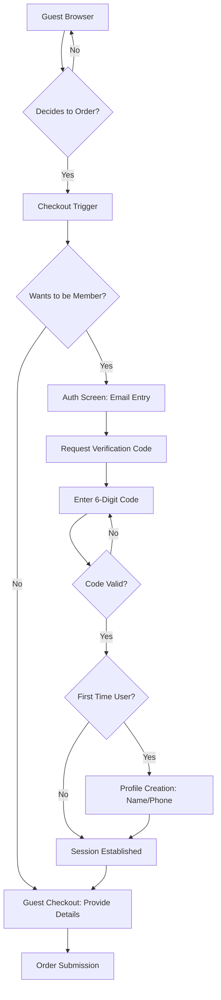
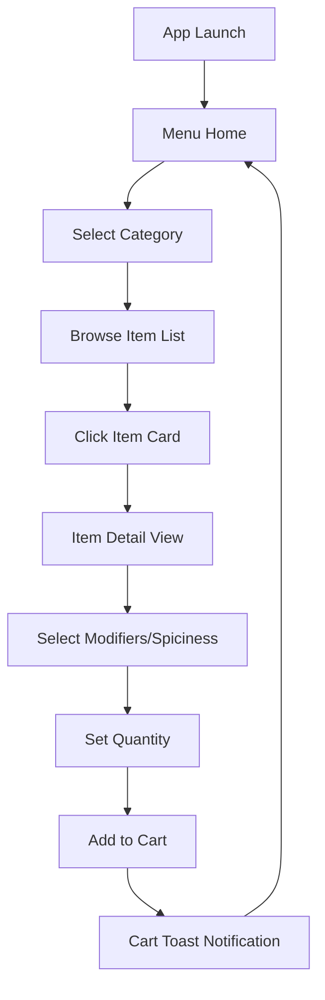
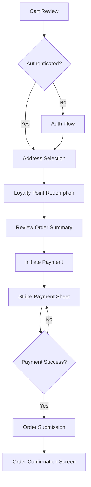
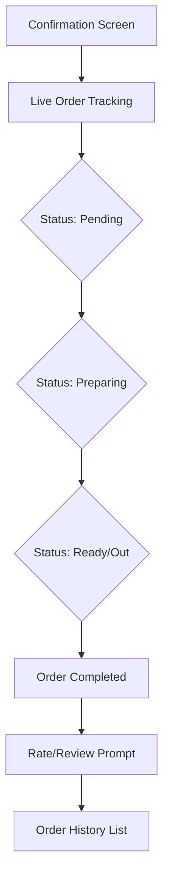
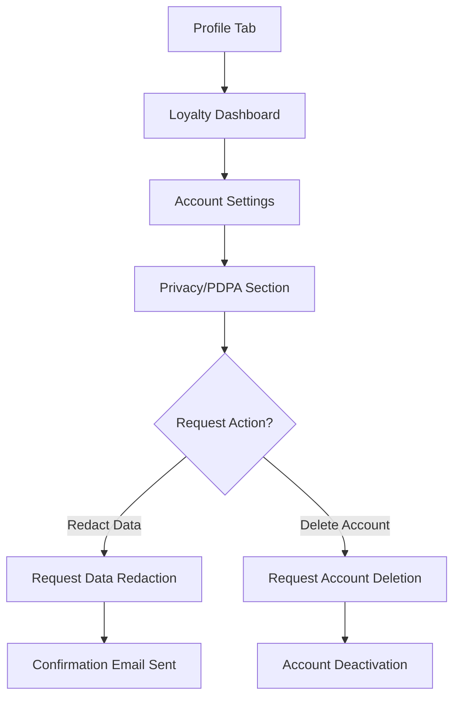

# User Flow Maps: Customer Mobile App

This document defines the detailed user journeys for the `authentic_th` Customer Mobile App. It translates the requirements from the **BRD** and **SDDs** into actionable UX flows using the **Trigger $\rightarrow$ Action $\rightarrow$ System Response** methodology.

## Architecture Context
- **Client State**: Zustand (Auth, Cart)
- **Server State**: TanStack Query (Menu, User Profile, Order Status)
- **Persistence**: `expo-secure-store` (JWT)
- **Payment**: Stripe Mobile SDK

---

## 1. Onboarding & Authentication Flow
**Journey Name**: Guest to Member (Optional)
**Objective**: Allow users to browse and order as guests, while providing a seamless path to membership for loyalty benefits.

### Flow Diagram

### Step-by-Step Breakdown
| Step | User Action | UI State Transition | System/API Interaction | Outcome |
|:---|:---|:---|:---|:---|
| 1 | Browse Menu as Guest | `MenuScreen` (Guest Mode) | `GET /api/menu` | User sees menu items |
| 2 | Click "Checkout" | Navigate to `AuthChoiceScreen` | N/A | User chooses Guest or Member |
| 3a | Select "Guest Checkout" | Redirect to `CheckoutScreen` | N/A | User proceeds without login |
| 3b | Select "Become Member" | Redirect to `AuthScreen` | N/A | Trigger authentication flow |
| 4 | (Member) Enter Email $\rightarrow$ Submit | Show "Enter Code" input | `POST /auth/request-code` | Verification code sent to email |
| 5 | (Member) Enter 6-digit code $\rightarrow$ Submit | Show Loading Spinner | `POST /auth/verify-code` | System validates code |
| 6 | (New Member) Enter Name/Phone $\rightarrow$ Save | Redirect to Checkout | `POST /auth/complete-profile` | User record created in DB |
| 7 | Session Initialized | Update Auth Store (Zustand) | `expo-secure-store.setItem(JWT)` | User is now authenticated |

---

## 2. Menu Exploration & Customization Flow
**Journey Name**: Discovery to Cart Addition
**Objective**: Enable the user to find a product and configure it specifically to their taste.

### Flow Diagram

### Step-by-Step Breakdown
| Step | User Action | UI State Transition | System/API Interaction | Outcome |
|:---|:---|:---|:---|:---|
| 1 | Launch App | `MenuScreen` (Loading) | `GET /api/menu` (TanStack Query) | Menu loaded into cache |
| 2 | Tap Category Tab | Filter `FoodItemList` | Local State Filter | Only items of category shown |
| 3 | Tap Food Item Card | Navigate to `ItemDetailScreen` | `GET /api/menu/{id}` | Detailed view with modifiers |
| 4 | Select Modifier (e.g. "Extra Spicy") | Update Local Selection State | N/A | Selection highlighted in UI |
| 5 | Tap "Add to Cart" | Show "Added!" Toast $\rightarrow$ Update Cart Badge | `Zustand: cartStore.addItem()` | Item added to local cart state |

---

## 3. Cart & Checkout Flow (High Priority)
**Journey Name**: Order Finalization & Payment
**Objective**: Securely move from a selection of items to a paid and submitted order.

### Flow Diagram

### Step-by-Step Breakdown
| Step | User Action | UI State Transition | System/API Interaction | Outcome |
|:---|:---|:---|:---|:---|
| 1 | Review Cart $\rightarrow$ "Checkout" | Navigate to `CheckoutScreen` | `GET /api/user/profile` (Points) | Total calculated with tax/fees |
| 2 | Select/Enter Delivery Address | Address Input Validated | N/A (Client-side) | Address bound to order session |
| 3 | Toggle "Use Loyalty Points" | Update `OrderSummary` total | `POST /loyalty/calculate-discount` | Total price reduced |
| 4 | Tap "Pay Now" | Show Loading $\rightarrow$ Open Stripe Sheet | `POST /api/payments/stripe` | Backend returns `client_secret` |
| 5 | Complete Card Auth (Stripe) | Stripe SDK processing overlay | Stripe API $\rightarrow$ Backend Webhook | Payment captured by Stripe |
| 6 | Payment Confirmed | Navigate to `ConfirmationScreen` | `POST /api/orders/confirm` | Order status $\rightarrow$ `Paid` |

---

## 4. Order Tracking & History Flow
**Journey Name**: Post-Purchase Monitoring
**Objective**: Provide transparency on order progress from kitchen to delivery.

### Flow Diagram

### Step-by-Step Breakdown
| Step | User Action | UI State Transition | System/API Interaction | Outcome |
|:---|:---|:---|:---|:---|
| 1 | View active order | `OrderTrackingScreen` | `GET /api/orders/{id}` (Polling) | Real-time status displayed |
| 2 | System update: $\rightarrow$ `Preparing` | Update Status Badge $\rightarrow$ Progress Bar | WebSocket / Polling | User sees order is in kitchen |
| 3 | System update: $\rightarrow$ `Ready` | Push Notification $\rightarrow$ Update UI | Push Notification Service | User notified to collect/wait |
| 4 | Order marked `Completed` | Show "Order Received" $\rightarrow$ Review UI | `PATCH /api/orders/{id}/complete` | Order moved to history |
| 5 | Navigate to "My Orders" | `OrderHistoryScreen` | `GET /api/orders/history` | List of past orders displayed |

---

## 5. Profile & Loyalty Management Flow
**Journey Name**: Account & Privacy Governance
**Objective**: Manage personal identity, loyalty rewards, and PDPA compliance requests.

### Flow Diagram

### Step-by-Step Breakdown
| Step | User Action | UI State Transition | System/API Interaction | Outcome |
|:---|:---|:---|:---|:---|
| 1 | Open Profile | `ProfileScreen` | `GET /api/user/profile` | Shows name, email, point balance |
| 2 | Tap "Loyalty Details" | `LoyaltyScreen` (Detailed Ledger) | `GET /api/loyalty/transactions` | List of point earns/spends |
| 3 | Navigate to "Privacy" | `PrivacySettingsScreen` | N/A | Display PDPA options |
| 4 | Tap "Delete My Data" | Show Warning Modal $\rightarrow$ Confirm | `DELETE /api/user/profile` | Request queued for hard-purge |
| 5 | Confirm Deletion | Redirect to Login $\rightarrow$ Clear Store | `expo-secure-store.deleteItem(JWT)` | Local session destroyed |
