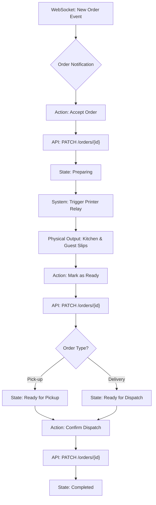
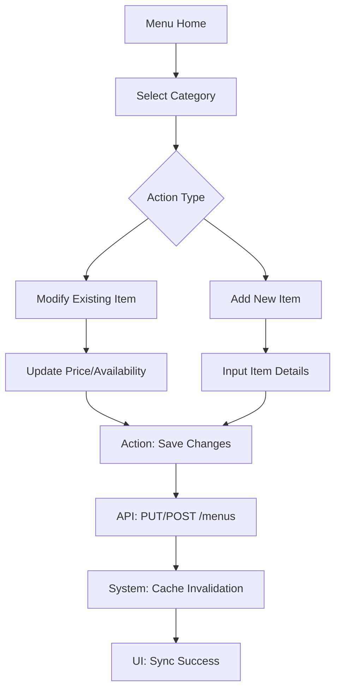
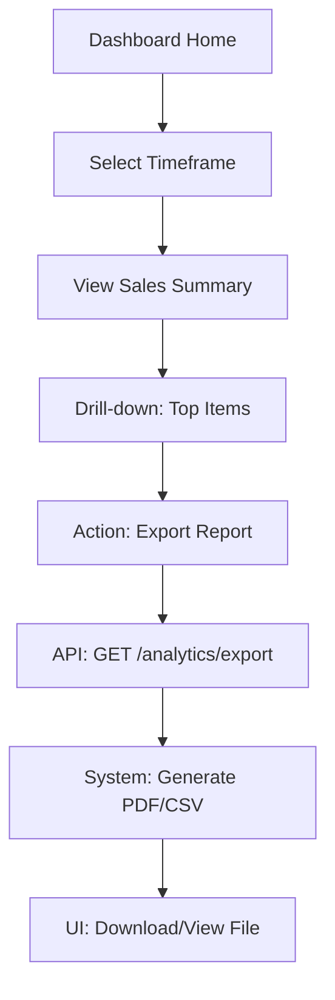
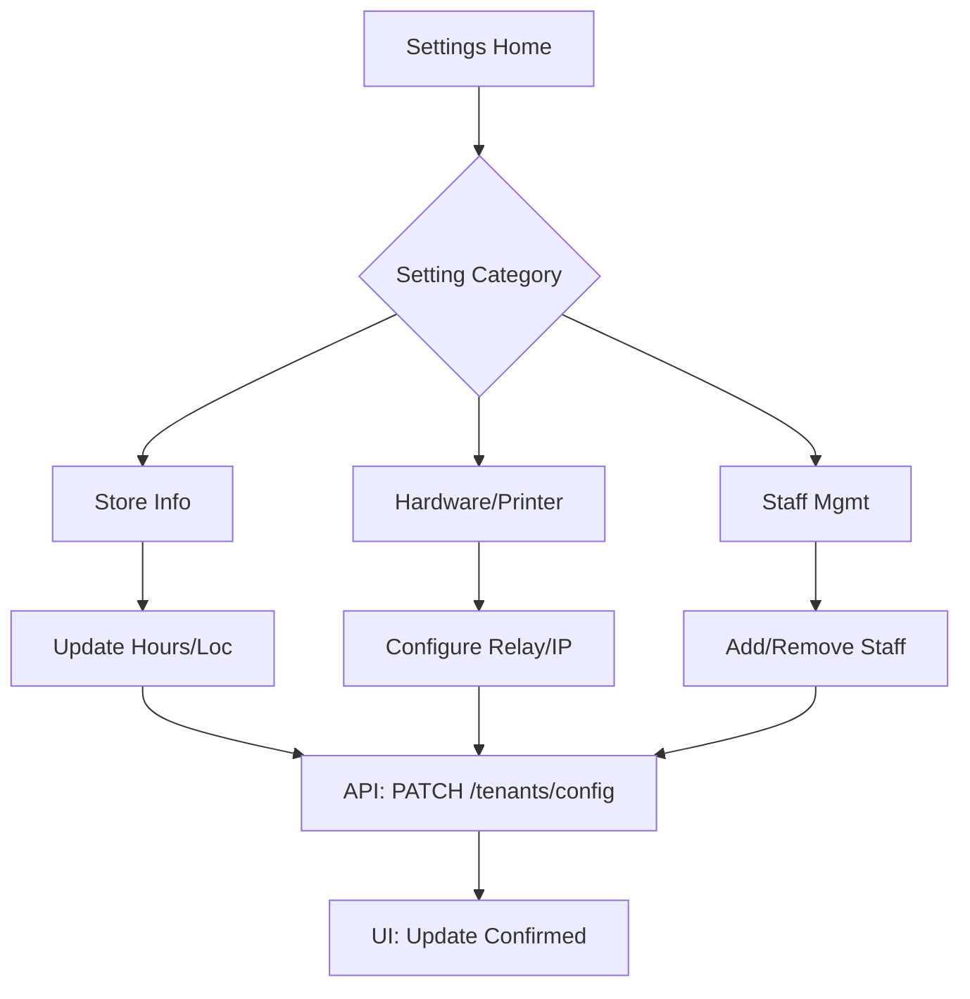
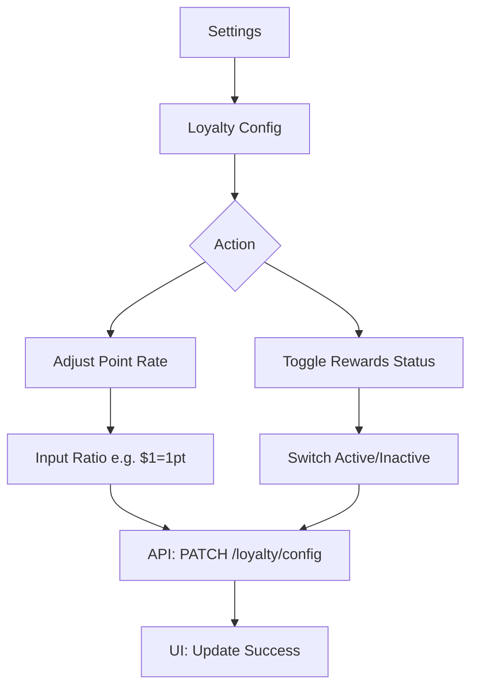
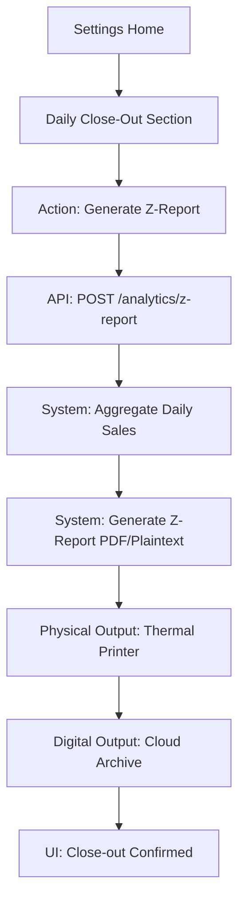

# User Flow Maps: Restaurant Mobile App

These User Flow Maps define the behavioral blueprint for the Restaurant Mobile App, ensuring adherence to the **Trigger $\rightarrow$ Action $\rightarrow$ System Response** methodology.

## Technical Architecture Summary
- **Frontend**: React Native (Expo)
- **State Management**: Zustand (Client State) + TanStack Query (Server State)
- **Real-time**: WebSockets (via Axum/Tokio) for Order & Status updates
- **Backend**: Rust/Axum Modular Monolith

---

## 1. Order Fulfillment Cycle (High Priority)
**Goal**: Move a customer order from "Paid" to "Completed" with real-time kitchen coordination, supporting both Pick-up and Delivery.

### Flow Diagram

### Step-by-Step Breakdown
| Step | User Action | UI State Transition | System/API Interaction | Outcome |
| :--- | :--- | :--- | :--- | :--- |
| 1 | (Passive) | Order Card pops up with alert sound | WS: `order_created` event $\rightarrow$ Zustand store | Order appears in "Pending" list |
| 2 | Tap "Accept Order" | Order moves from "Pending" $\rightarrow$ "Preparing" | `PATCH /api/v1/orders/{id}` (status: Preparing) | Order locked; Customer notified |
| 3 | (System) | "Printing..." indicator on card | API $\rightarrow$ Printer Relay Service | Kitchen & Guest slips printed automatically |
| 4 | Tap "Mark Ready" | Order moves from "Preparing" $\rightarrow$ "Ready" | `PATCH /api/v1/orders/{id}` (status: Ready) | Customer/Driver notified via Push/WS |
| 5 | Tap "Confirm Pickup/Dispatch" | Order moves from "Ready" $\rightarrow$ "Completed" | `PATCH /api/v1/orders/{id}` (status: Completed) | Order archived; Loyalty points triggered |

---

## 2. Menu Management Flow
**Goal**: Maintain the digital storefront's product catalog and availability.

### Flow Diagram

### Step-by-Step Breakdown
| Step | User Action | UI State Transition | System/API Interaction | Outcome |
| :--- | :--- | :--- | :--- | :--- |
| 1 | Select Category | List of items in category displayed | `GET /api/v1/menus?category=X` | Category filtered view |
| 2 | Toggle "Available" | Switch changes state (ON $\rightarrow$ OFF) | `PATCH /api/v1/menus/{id}` (is_available: bool) | Item hidden from storefront |
| 3 | Edit Price $\rightarrow$ Save | Edit modal $\rightarrow$ Loading state | `PUT /api/v1/menus/{id}` (price: decimal) | Price updated in DB |
| 4 | "Add Item" $\rightarrow$ Submit | Form $\rightarrow$ Success Toast | `POST /api/v1/menus` (item_data) | New item visible in catalog |
| 5 | (System) | (Background) | Redis: `DEL menu:{tenant_id}` | Global storefront cache refreshed |

---

## 3. Business Performance Review Flow
**Goal**: Provide the Owner with actionable insights into sales and product performance.

### Flow Diagram

### Step-by-Step Breakdown
| Step | User Action | UI State Transition | System/API Interaction | Outcome |
| :--- | :--- | :--- | :--- | :--- |
| 1 | Open Dashboard | Summary cards (Daily/Weekly) | `GET /api/v1/analytics/summary` | High-level KPIs visible |
| 2 | Change Date Range | Charts refresh with animation | `GET /api/v1/analytics?start=...&end=...` | Data filtered by time |
| 3 | Tap "Top Products" | Renders ranked list of items | `GET /api/v1/analytics/top-items` | Identification of best-sellers |
| 4 | Tap "Export" | Loading spinner $\rightarrow$ File prompt | `GET /api/v1/analytics/export?format=pdf` | Local copy of report saved |

---

## 4. Business Profile & Settings Flow
**Goal**: Configure store operational parameters and hardware integration.

### Flow Diagram

### Step-by-Step Breakdown
| Step | User Action | UI State Transition | System/API Interaction | Outcome |
| :--- | :--- | :--- | :--- | :--- |
| 1 | Edit Store Hours | Time-picker modal | `PATCH /api/v1/tenants/{id}/config` | Storefront updated for customers |
| 2 | Enter Printer IP | Input field $\rightarrow$ "Test Print" | `POST /api/v1/printers/test` | Backend sends test signal to Relay |
| 3 | Save Printer Config | Loading $\rightarrow$ Success Checkmark | `PATCH /api/v1/tenants/{id}/config` | Printer bound to tenant |
| 4 | Invite Staff Email | Input $\rightarrow$ "Send Invite" | `POST /api/v1/users/invite` | Email invite sent; User record created |

---

## 5. Loyalty Configuration Flow
**Goal**: Control the incentive engine for customer retention.

### Flow Diagram

### Step-by-Step Breakdown
| Step | User Action             | UI State Transition                 | System/API Interaction                         | Outcome                                  |
| :--- | :---------------------- | :---------------------------------- | :--------------------------------------------- | :--------------------------------------- |
| 1    | Navigate to Loyalty     | Loyalty dashboard displayed         | `GET /api/v1/loyalty/config`                   | Current rates and status visible         |
| 2    | Change Conversion Rate  | Numeric input $\rightarrow$ Confirm | `PATCH /api/v1/loyalty/config` (rate: x)       | Future orders use new point calculation  |
| 3    | Toggle "Rewards Active" | Switch state change                 | `PATCH /api/v1/loyalty/config` (enabled: bool) | Points accrual enabled/disabled globally |
| 4    | Save Changes            | Toast: "Loyalty settings updated"   | (Concurrent with above)                        | Configuration persisted in DB            |

---

## 6. Daily Close-Out (Z-Report) Flow
**Goal**: Finalize the business day's financial totals and generate a physical/digital Z-Report.

### Flow Diagram

### Step-by-Step Breakdown
| Step | User Action | UI State Transition | System/API Interaction | Outcome |
| :--- | :--- | :--- | :--- | :--- |
| 1 | Navigate to Settings $\rightarrow$ Close-Out | Display current day's totals summary | `GET /api/v1/analytics/today` | Pre-close summary visible |
| 2 | Tap "Generate Z-Report" | Show Loading Spinner $\rightarrow$ "Printing..." | `POST /api/v1/analytics/z-report` | Backend calculates daily totals |
| 3 | (System) | (Background) | API $\rightarrow$ Printer Relay Service | Physical Z-Report printed at store |
| 4 | (System) | Success Toast: "Z-Report Generated" | `POST /api/v1/analytics/archive` | Day's data locked and archived |
